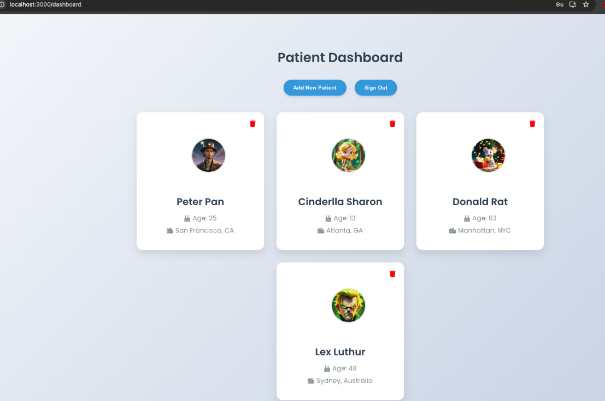

# MindMap AI

MindMap AI is a web application designed to assist therapists in gathering and analyzing patient information using AI. By leveraging advanced AI technologies, MindMap AI helps therapists understand and manage patients' mental health, particularly focusing on issues such as depression.

## Why MindMap AI?

Depression and other mental health issues can significantly impact a person's life. MindMap AI aims to provide therapists with powerful tools to gain insights from their patients, helping to make the therapeutic process more effective and efficient.

## Features

- Secure login for therapists
- Dashboard to manage patient information
- AI-driven insights and analysis
- Easy-to-use interface for adding and managing patient data

## Screenshots

### Login Screen

### Dashboard

## Getting Started

To get a local copy up and running, follow these simple steps.

### Prerequisites

- Node.js and npm installed on your local machine
- Python3.12 for the backend (Checkout the backend repository)

### Installation

1. Clone the repo
   git clone https://github.com/shivambajaj5329/MindMap.ai-frontend

2. Navigate to the project directory
   cd MindMapAI

3. Install NPM packages
   npm install

4. Create a `.env` file in the root of the project and add your Firebase configuration:
   REACT_APP_FIREBASE_API_KEY=your_api_key
   REACT_APP_FIREBASE_AUTH_DOMAIN=your_auth_domain
   REACT_APP_FIREBASE_PROJECT_ID=your_project_id
   REACT_APP_FIREBASE_STORAGE_BUCKET=your_storage_bucket
   REACT_APP_FIREBASE_MESSAGING_SENDER_ID=your_messaging_sender_id
   REACT_APP_FIREBASE_APP_ID=your_app_id
   REACT_APP_FIREBASE_MEASUREMENT_ID=your_measurement_id

5. Start the development server
   npm start

## Usage

1. Open your browser and navigate to `http://localhost:3000`.
2. Log in using your therapist credentials.
3. Add and manage patient information through the dashboard.
4. Utilize AI-driven insights to better understand and assist your patients.

## Contributing

Contributions are what make the open-source community such an amazing place to learn, inspire, and create. Any contributions you make are **greatly appreciated**.

1. Fork the Project
2. Create your Feature Branch (git checkout -b feature/AmazingFeature)
3. Commit your Changes (git commit -m 'Add some AmazingFeature')
4. Push to the Branch (git push origin feature/AmazingFeature)
5. Open a Pull Request

## License

Distributed under the MIT License. See `LICENSE` for more information.

## Contact

Your Name - shivamb1298@gmail.com

Project Link: https://github.com/shivambajaj5329/MindMap.ai-frontend
